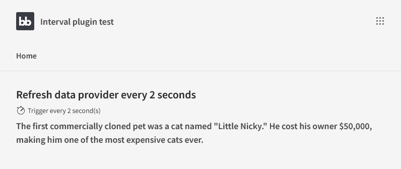
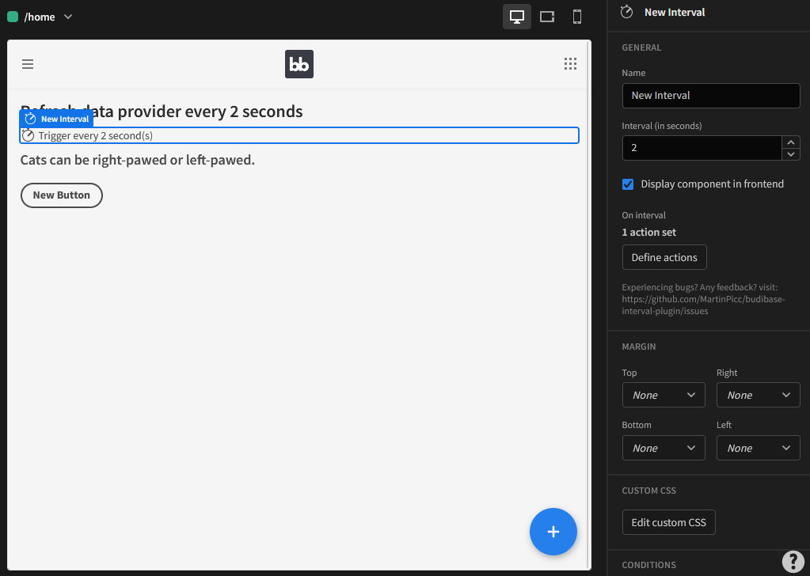

# Timeout (Budibase Plugin)



## Description
Set time timeout to trigger actions.

* Set time timeout in seconds
* Define a list of actions to run after X seconds
* Show or hide the component on the frontend



Find out more about [Budibase](https://github.com/Budibase/budibase).

## Instructions

### Add to budibase via Github URL

In your Budibase admin panel, go to Plugins > Add plugin > In source select "Github" > in URL copy-paste "https://github.com/xnohat/budibase-timeout-plugin" > Click "Save" button.

Timeout plugin should appear now in the list of plugins.

### Build

To build your new  plugin run the following in your Budibase CLI:
```
budi plugins --build
```

You can also re-build everytime you make a change to your plugin with the command:
```
budi plugins --watch
```

